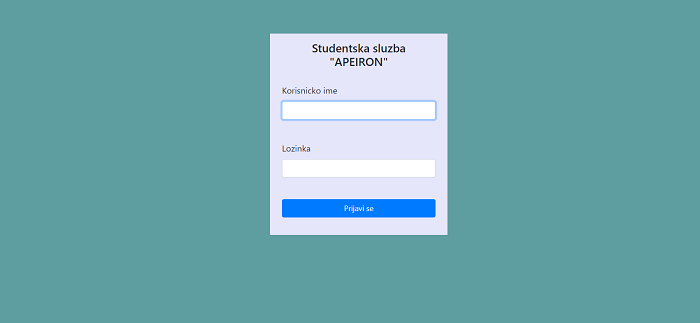
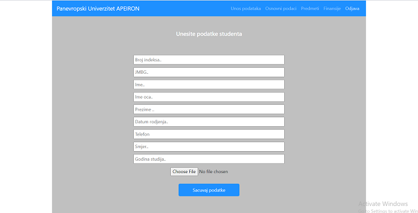
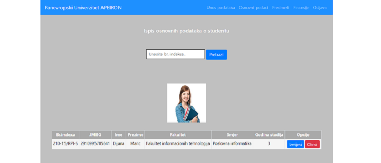
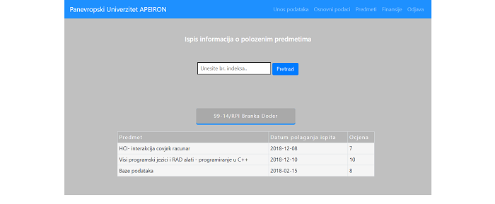
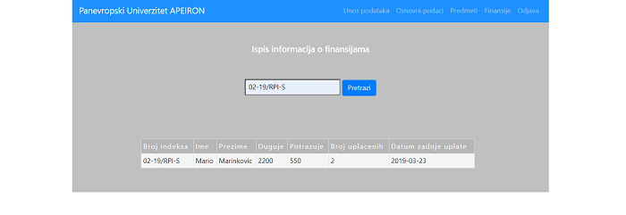

## Table of contents
* [General info](#general-info)
* [Technologies](#technologies)
* [Screenshots](#Screenshots)

## General info 

"Faculty student service" is my first php project, created during the first steps of learning procedural programming,
data validation, CRUD functionality, database interaction and users login. 

During the enrollment of students for the new school year, the user(admin) can enter his data, has the ability to search for
registered students, has insight into the passed subjects and grades, as well as insight into the student's financial obligation to the faculty..
	
## Technologies
Project is created with:
* HTML5, CSS3
* Bootstrap: 3.4
* PHP: 7.2.5

## Screenshots
* Login form.

***

* Add new student.

***

* Search students by index number.

***

* List students subjects and grades.

***

* List students financial obligations.

***

